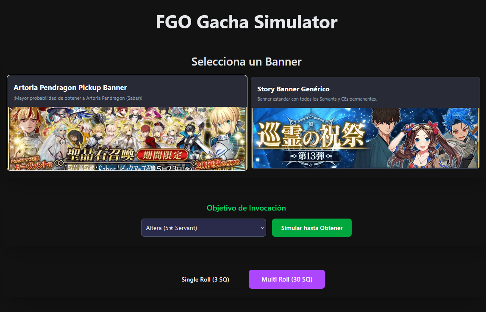
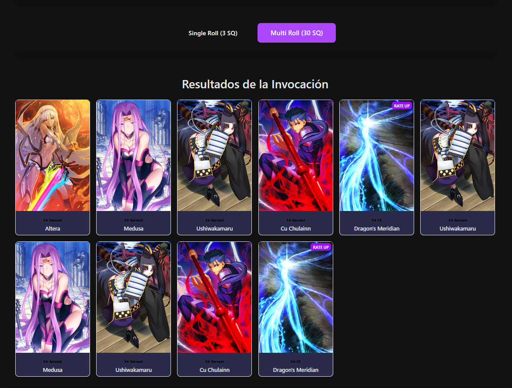
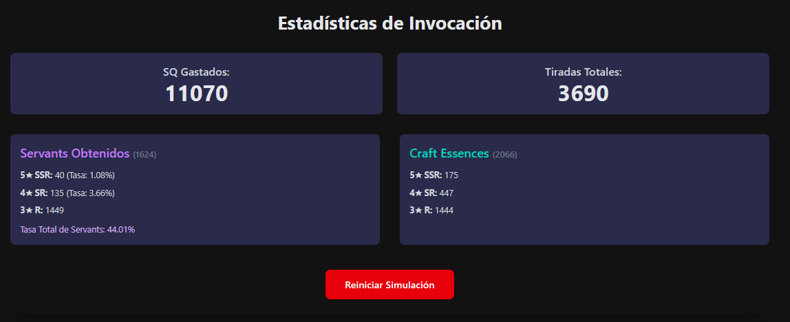

# Gacha Simulator (FGO)
# ✨ FGO Gacha Simulator ✨

<p align="center">
  
</p> 

Un simulador web que recrea la experiencia de "rollear" en el juego de celular Fate/Grand Order, permitiendo a los usuarios probar su suerte en diferentes banners con tasas de aparición precisas.

<p align="center">
  
  
  
  
</p> 

## 🚀 Capturas de Pantalla


El usuario seleccionando un banner de invocación.


Visualización de los Servants y CEs obtenidos en una tirada múltiple.


Sección de estadísticas mostrando SQ gastado y rarezas obtenidas.


## 🌟 Características Principales

*   **Selección de Banner:** Elige entre diferentes banners con Servants y CEs destacados y sus tasas específicas.
*   **Simulación de Tiradas:** Realiza tiradas individuales (Single Roll) y múltiples (Multi-Roll).
*   **Tasas de Aparición Precisas:** Lógica en el backend que simula las probabilidades correctas de FGO (simplificadas).
*   **Visualización de Resultados:** Muestra las cartas obtenidas con sus imágenes, rareza y nombre.
*   **Estadísticas de Usuario:** Lleva un registro del "Saint Quartz" gastado y un resumen de lo obtenido.
*   **Objetivos de Invocación:** Simula tiradas automáticamente hasta obtener un Servant o CE específico.
*   **Interfaz Amigable:** Diseño responsivo y atractivo utilizando Tailwind CSS con un tema oscuro.

## 🛠️ Tecnologías Utilizadas

*   **Frontend:**
    *   [React.js](https://reactjs.org/)
    *   [Vite](https://vitejs.dev/)
    *   [TypeScript](https://www.typescriptlang.org/)
    *   [Tailwind CSS](https://tailwindcss.com/)
*   **Backend:**
    *   [Nest.JS](https://nestjs.com/) 
*   **Estructura:**
    *   Monorepo 

## ⚙️ Configuración y Ejecución Local

### Prerrequisitos

*   [Node.js](https://nodejs.org/) (v18.x o superior recomendado)
*   [npm](https://www.npmjs.com/) 
*   Git

### Pasos para la Instalación

1.  **Clona el repositorio:**
    ```bash
    git clone https://github.com/bryanHcarvajal/gacha-simulator.git
    cd gacha-simulator
    ```

2.  **Instala las dependencias del Backend:**
    ```bash
    cd apps/backend
    npm install 
    ```

3.  **Instala las dependencias del Frontend:**
    ```bash
    cd ../frontend 
    # (Si estabas en apps/backend, sino cd apps/frontend desde la raíz)
    npm install
    ```

### Ejecución

1.  **Inicia el Servidor Backend:**
    Desde la carpeta `apps/backend`:
    ```bash
    npm run start:dev
    ```
    El backend estará disponible en `http://localhost:3000` (o el puerto que tengas configurado).

2.  **Inicia la Aplicación Frontend:**
    Desde la carpeta `apps/frontend` (en una nueva terminal):
    ```bash
    npm run dev
    ```
    La aplicación frontend estará disponible en `http://localhost:5173` (o el puerto que Vite asigne).

Abre tu navegador y ve a la URL del frontend para usar el simulador.


